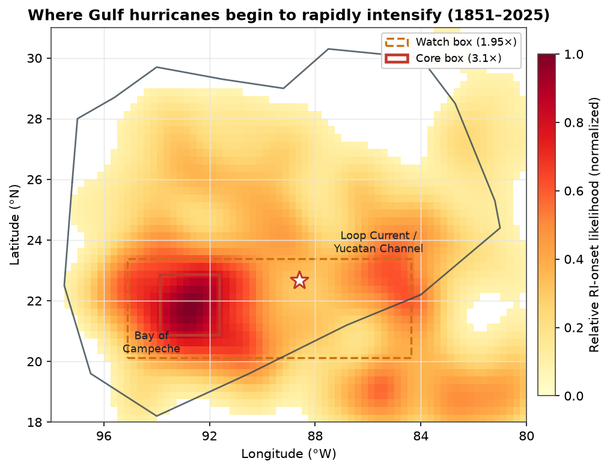
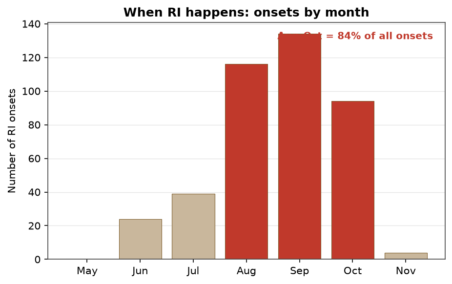
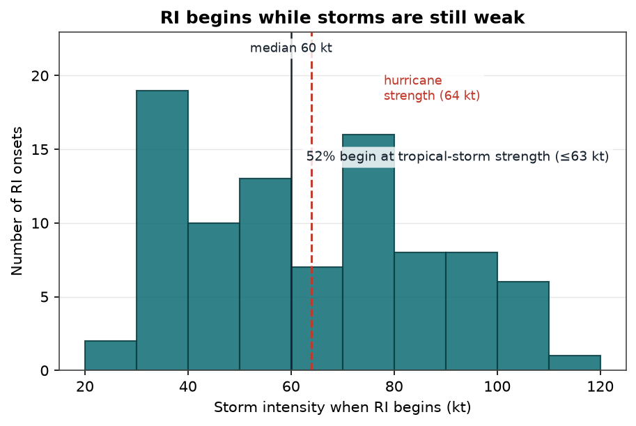
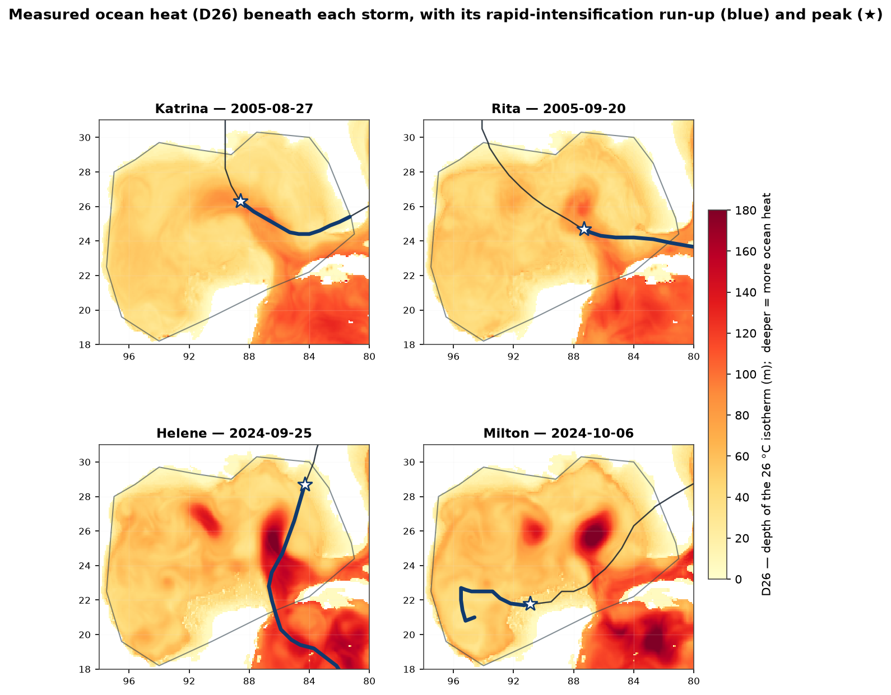
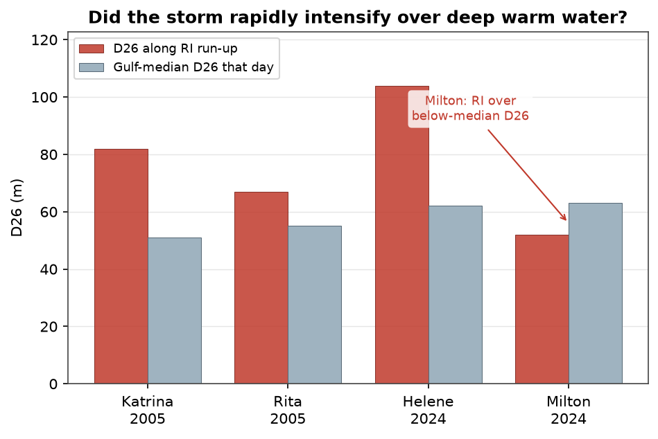
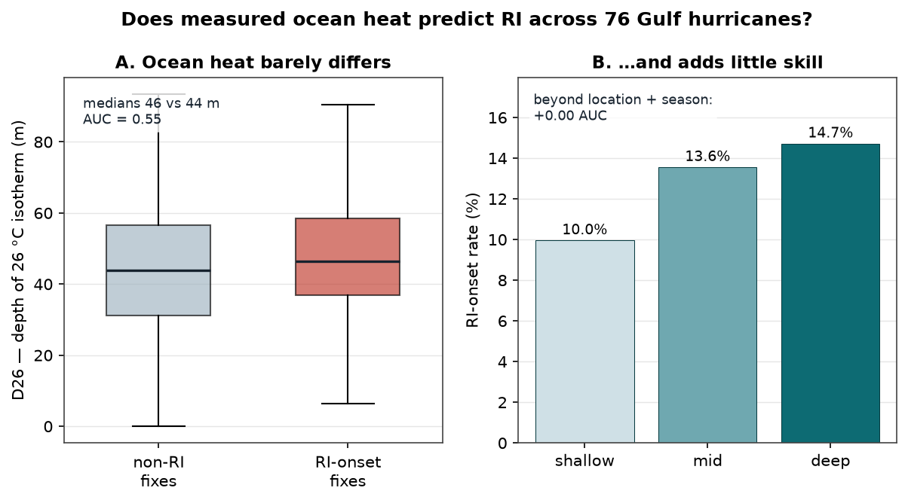
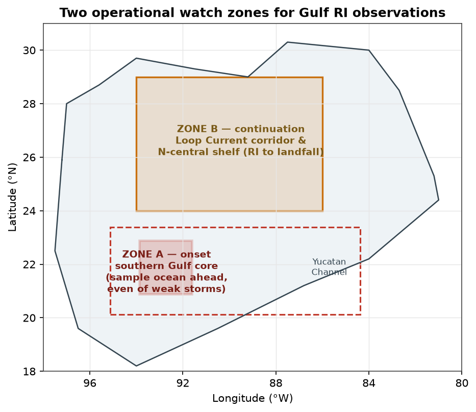

# Understanding Hurricane Rapid Intensification Dynamics

#### A climatological targeting recommendation for rapid-intensification (RI) observations in the Gulf of Mexico

*Technical memorandum · RapidWatch independent analysis · not for distribution*[^data]

| | |
|---|---|
| **Author** | Alex Philp, Ph.D. — RapidWatch |
| **Date** | 21 June 2026 *(revised 22 June 2026)* |
| **Prepared for** | NOAA National Hurricane Center (NHC); AOML Hurricane Research Division (HRD); Office of Marine & Aviation Operations / Aircraft Operations Center (OMAO/AOC); NESDIS; U.S. IOOS Underwater Glider Program |

---

## Abstract

Rapid intensification — a large, fast increase in a hurricane's wind speed over a single day — is the most difficult part of hurricane forecasting and among the most dangerous situations for coastal communities, because it can turn a modest storm into a major one with little warning. The Gulf of Mexico is where this occurs most frequently in the United States.

Using the complete NOAA best-track record of Atlantic hurricanes from 1851 to 2025, this analysis maps where and when rapid intensification occurs in the Gulf. Three results stand out. First, it is geographically concentrated: a storm is roughly three times more likely to begin rapidly intensifying in a specific zone of the southern Gulf — the Bay of Campeche and the Loop Current region — than in the Gulf on average. Second, it is strongly seasonal, with most cases in September and the large majority between August and October. Third, it typically begins while a storm is still weak, before it appears threatening.

The analysis also used reconstructed ocean-temperature data to test directly whether the depth of warm water beneath a storm predicts rapid intensification. In individual major storms, intensification did occur over unusually deep warm water, consistent with established physics. Across 76 storms, however, the depth of warm water added little predictive information beyond a storm's location and the time of year — because location and season already indicate where the deep warm water lies.

Together these results support a specific operational conclusion. Observations intended to improve rapid-intensification forecasts should be concentrated in the southern Gulf during late summer, positioned ahead of approaching or developing storms — including weak ones. The principal value of real-time ocean-heat measurements is in initializing the coupled computer models that forecast an individual storm, rather than in serving as a stand-alone climatological warning signal.

---

> **Rapid intensification.** A tropical cyclone is said to rapidly intensify when its maximum sustained wind increases by at least 30 knots (about 35 mph) within 24 hours — the 95th percentile of all 24-hour over-water intensity changes in the North Atlantic [1]. This threshold, the operational standard, is used throughout this memorandum.

---

## 1. Executive summary

Rapid intensification remains the single hardest problem in hurricane forecasting [3], and the Gulf of Mexico is where it most often turns a routine system into a coastal catastrophe with little warning — Camille in 1969, Katrina and Rita in 2005 [5][6], Michael in 2018 [18], Ida in 2021, and Milton in 2024 [17]. The physical ingredients are well understood. Warm sea-surface temperature supplies the fuel, since tropical cyclones require water of roughly 26 °C or more [8][9]; deep warm water amplifies intensification by suppressing the cold wake that would otherwise cap it [4][6]; and low vertical wind shear acts as an on/off switch [7]. This memorandum addresses the operational question that follows from that understanding — where and when to concentrate scarce observing assets in order to capture the process.

Drawing on 175 years of NOAA best-track data [10], we constructed an observed climatology of rapid intensification in the Gulf, and its findings are consistent with the peer-reviewed literature [19][20]. Rapid intensification is geographically concentrated: a storm is about three times more likely to begin rapidly intensifying inside a small core region of the southern Gulf — the Bay of Campeche and the southwestern flank of the Loop Current, near 21–23 °N and 92–94 °W — than in the Gulf on average, with 23 percent of fixes there qualifying as onsets against 7.5 percent basin-wide. It is strongly seasonal, with September the peak month and 84 percent of all onsets falling between August and October. And it usually begins while a storm is still weak: the median intensity at onset is 50 knots, and two-thirds of onsets occur at tropical-storm strength or below, so the systems that ultimately explode are rarely the ones that already look dangerous. The hotspot coincides with the Gulf's two deepest warm-water features, as the ocean-heat mechanism predicts [4][5][6]. A direct test against reconstructed ocean-heat fields (Section 5.7) confirms that mechanism case by case, yet shows that the depth of warm water adds no climatological skill beyond location and season, because geography and season already encode it.

The recommendation that follows is correspondingly specific. When a system forms in, or is forecast to enter, the Gulf — including the approach through the Yucatan Channel from the northwest Caribbean — observing assets should be positioned over the southern-Gulf core ahead of the storm, 12 to 36 hours before projected onset, even when the system is only a tropical storm. A second, higher-stakes watch follows the Loop Current corridor and the north-central shelf, where rapid intensification continues toward United States landfall. Section 6 sets out the protocol and Section 7 the platforms.

---

## 2. The problem and why it matters

Track forecasts have improved markedly over three decades, but intensity forecasts, and rapid intensification in particular, have lagged, even as guidance slowly improves [3]. The National Hurricane Center has run a statistical–dynamical Rapid Intensification Index operationally since 2008 [2], yet skill remains limited by two well-established problems. The first is ocean initialization. Coupled models, including NOAA's operational Hurricane Analysis and Forecast System and its HYCOM ocean component, are sensitive to the pre-storm upper-ocean heat field, and adding a dynamic ocean measurably changes intensity forecasts [11][12]. Where the 26 °C isotherm lies deep, the storm's own cold wake is suppressed and intensification continues unchecked [4][6]; where it is shallow, mixing shuts the storm down. Yet the subsurface ocean is sparsely observed where it matters most [13]. The second problem is the scarcity of inner-core observations of developing systems. Reconnaissance and field campaigns have repeatedly demonstrated the value of inner-core and targeted observations for intensity forecasting [16], but tasking is understandably weighted toward storms that already threaten land and already look strong. Because rapid intensification begins in weak systems (Section 5.3), the pre-onset inner core is systematically under-sampled.

The Gulf concentrates both problems. It is small, semi-enclosed, ringed by dense population, and threaded by the deepest warm water in the basin [4][5], so a targeting strategy here offers an unusually high return on a fixed observing budget.

---

## 3. Data and method

The analysis draws on HURDAT2 (1851–2025), comprising 2,004 Atlantic systems at 6-hourly best-track resolution [10], restricted to the 326 hurricanes that both reached hurricane strength and entered a Gulf-of-Mexico polygon, with Caribbean- and Atlantic-only systems excluded by a hand-drawn coastline mask. An RI onset is identified at any fix whose wind rises by at least 30 knots over the following 24 hours, taking the nearest fix in a 21-to-27-hour window, the standard threshold [1]; the onset is located at the starting fix, the place and time at which one would want eyes on the ocean before the storm intensifies. To distinguish genuine preference from mere traffic, the Gulf domain (18–31 °N, 80–98 °W) is gridded at 0.25°, and each cell records both its onsets and all hurricane fixes passing through, so that the quantity of interest is propensity — onsets divided by traffic — rather than where storms happen to travel. A Gaussian kernel-density estimate of the onset points, with a 0.75° bandwidth, yields a smooth likelihood surface and the nested core and watch boxes; the lift reported throughout is the conditional probability of an onset given a hurricane fix inside a box, relative to the domain average.

These are the products of a climatology, a historical prior rather than a dynamical forecast. Best-track winds carry uncertainty that is larger before the aircraft-reconnaissance era (pre-1944) and before satellites (pre-1966) [10], and observing density has grown over time, which can inflate apparent activity in recent decades and along historical shipping lanes. The 30 kt / 24 h threshold is one common definition [1], though the results are stable under variations of about ±5 knots. The onset-location signal also reflects an intensity-ceiling effect, since weak systems entering from the south have the most room to gain 30 knots, but that property is itself operationally useful because it directs attention to the southern entry. None of these considerations moves the hotspot off the deep-warm-water features.

---

## 4. Headline numbers

| Quantity | Value |
|---|---|
| Gulf hurricanes analyzed (1851–2025) | 326 |
| …that underwent ≥ 1 RI onset inside the Gulf | 152 (47%) |
| Total RI-onset intervals detected | 411 |
| Domain-average P(RI onset \| fix) | 7.5% |
| Core box P(RI onset \| fix) — 20.9–22.9 °N, 91.6–93.9 °W | 23.1% (3.1× lift) |
| Watch box P(RI onset \| fix) — 20.1–23.4 °N, 84.4–95.1 °W | 14.6% (1.95× lift) |
| Peak-density cell | 21.6 °N, 92.9 °W |
| Onset-weighted centroid | 22.7 °N, 88.6 °W |
| Peak month / Aug–Oct share | September / 84% |
| Median intensity at RI onset | 50 kt |
| RI onsets beginning at ≤ tropical-storm strength | 66% |
| RI onsets beginning at ≤ Cat 1 | 87% |

---

## 5. Findings

### 5.1 Where RI begins — the southern-Gulf core
The density of RI onsets peaks over the southern Gulf, with the tightest core over the Bay of Campeche and the southwestern flank of the Loop Current (about 20.9–22.9 °N, 91.6–93.9 °W) and a broader elevated zone fanning eastward toward the Yucatan Channel and the Loop Current intrusion (centroid 22.7 °N, 88.6 °W). Inside the core box, nearly one fix in four is an RI onset, 3.1 times the basin average. This is a genuine preference rather than a traffic artifact, since it survives normalization by total storm fixes.

*__Figure 1.__ Observed rapid-intensification onset likelihood across the Gulf, 1851–2025, normalized by storm traffic so that the field reflects propensity rather than where storms merely travel. The densest onset region is the Bay of Campeche and the southwestern Loop Current; the solid box marks the 3.1×-lift core, the dashed box the broader elevated zone (1.95×). The star is the onset-weighted centroid.*

### 5.2 When — September, and the warm-ocean season
RI onset is strongly seasonal. September is the modal month, and August through October account for 84 percent of all onsets. This is the season when sea-surface temperature is at its annual peak, when the Loop Current and its shed warm-core eddies carry the deepest warm layer [4][5], and when basin-wide shear is climatologically lowest [7] — the three ingredients of rapid intensification in simultaneous alignment.

*__Figure 2.__ Rapid-intensification onsets by calendar month. August–October (highlighted) account for 84% of all onsets, peaking sharply in September.*

### 5.3 At what intensity — weak systems, not strong ones
Rapid intensification begins early. The median intensity at onset is 50 knots, that of a moderate tropical storm; two-thirds of onsets occur at tropical-storm strength or below, and 87 percent at Category 1 or below. By the time a storm looks dangerous, the window most in need of observation has often already opened. Targeting must therefore extend to developing systems, a conclusion reinforced by the operational RI-index literature, which ranks current intensity and persistence among the leading climatological predictors [1][2].

*__Figure 3.__ Storm intensity at the moment rapid intensification begins. Most onsets occur while a storm is still at tropical-storm strength (≤ 63 kt), well before it appears threatening — the systems that ultimately blow up are not the ones that already look dangerous.*

### 5.4 Why — the hotspot sits on the deep warm water
The geography is not a coincidence. The core and elevated zones overlie the Gulf's two deepest warm-water features: the Loop Current, which carries deep, warm Caribbean water through the Yucatan Channel and sheds warm-core eddies westward [4][6], and the warm pool of the Bay of Campeche over the Campeche Bank. These are the regions of highest upper-ocean heat content, the amplifier of the three ingredients. Warm-core features suppress the storm-induced sea-surface cooling that would otherwise limit intensification, a mechanism documented for Hurricane Opal in 1995 [4] and for Hurricanes Katrina and Rita in 2005, whose intensification tracked the Loop Current's dynamic topography rather than sea-surface temperature alone [5][6]. In the warm season the fuel (sea-surface temperature [8][9]) and the switch (low shear [7]) are satisfied as well, so all three ingredients coincide over the core box. The record bears this out: the strongest 24-hour jumps in the database — Milton in 2024, a gain of 80 knots over the Bay of Campeche [17]; the 1932 Cuba–Texas hurricane; Anita in 1977; and the Katrina–Rita pair over the Loop Current corridor [5] — all occurred over these features.

### 5.5 Two distinct operational zones
Onset and impact do not occur in the same place. Rapid intensification most often begins in what we term Zone A, the southern-Gulf onset region defined by the core box (Section 5.1), among weak systems entering from the Caribbean or forming in the Bay of Campeche; this is the best place to catch the process early. It most often continues in Zone B, the Loop Current corridor and north-central shelf, roughly 24–29 °N and 86–94 °W, where storms intensify toward United States landfall — Katrina, Rita [5][6], Michael, reanalyzed to Category 5 at the Florida Panhandle coast [18], and Ida — and where the stakes for warning are highest. A storm that intensifies in Zone A and then tracks north re-intensifies over this corridor and shelf, so a complete strategy samples both: the ocean ahead of the storm in Zone A to catch onset, and the warm corridor ahead of a northbound storm in Zone B to forecast landfall intensity.

### 5.6 Consistency with published climatology
These results are not an artifact of one method. Yaukey (2014) found that the highest mean tropical-cyclone intensification rates in the North Atlantic occur in the Gulf of Mexico and the Caribbean Sea [20], and Benedetto and Mercer (2020) produced a spatiotemporal climatology of North Atlantic rapid intensification from the same HURDAT record and likewise identified the Gulf and western Caribbean as a preferred region [19]. The present analysis adds three things: it restricts attention to Gulf-entering hurricanes, it normalizes by storm traffic to isolate propensity rather than exposure, and it translates the result into an explicit, coordinate-bounded observing target with a quantified lift.

---

### 5.7 A direct test with measured ocean heat (D26)
Sections 5.1 through 5.4 infer the ocean-heat link from geography; with the RapidWatch ocean pipeline it can be tested directly, by reconstructing the measured depth of the 26 °C isotherm — from the HYCOM GOFS 3.1 reanalysis for storms through 2015 [21] and Copernicus Marine GLORYS for 2016 through 2025 [22] — and co-locating it with the best track.

Sampling that depth at each storm's onset, three of the four marquee storms rapidly intensified over distinctly deep warm water: Katrina over 82 metres, Rita over 67, and Helene over 104, each 1.2 to 1.7 times the contemporaneous Gulf-median depth. Milton, in 2024, is the instructive exception. The most explosive case on record, gaining 80 knots in a day, it began intensifying over the Bay of Campeche where the warm layer was only about 52 metres deep, below the Gulf median; its fuel was record sea-surface temperature and near-zero shear rather than the deepest ocean heat. Deep warm water amplifies rapid intensification but is not its sole trigger.

*__Figure 4.__ Measured ocean heat (depth of the 26 °C isotherm, D26) beneath each of the four storms at its rapid-intensification time, with the storm track (black), the strengthening run-up to peak intensity (blue), and the peak (★). Darker red marks deeper warm water. Katrina, Rita, and Helene intensified over the deep warm Loop Current region of the central and eastern Gulf; Milton intensified over the Bay of Campeche.*

*__Figure 5.__ Measured D26 along each storm's RI run-up versus the Gulf-median D26 that day. Three of four storms intensified over distinctly deep warm water (1.2–1.7× the median); Milton (2024) is the instructive exception — its record rapid intensification occurred over below-median D26 in the Bay of Campeche, driven by record SST and near-zero shear.*

Across the full ocean-reanalysis-era population — 76 Gulf hurricanes, 698 six-hourly fixes, 89 of them RI onsets — that single-storm signal largely dissolves, and the reason is instructive. Warm-water depth does separate onset fixes from non-onset fixes, but only faintly: median D26 of 46 versus 44 metres, a Mann–Whitney *p* of about 0.07, and an area under the ROC curve of 0.55, where 0.5 is no skill. Taken alone, depth is at best a marginal discriminator. The more telling test, however, is not whether depth carries *any* signal but whether it carries *independent* signal — whether it sharpens prediction once the obvious predictors are already in hand. It does not: in a cross-validated model, adding D26 to latitude, longitude, season, and current intensity leaves out-of-sample skill essentially unchanged (AUC 0.693 to 0.689). The result is redundancy, not irrelevance. Deep warm water genuinely fuels intensification in any individual storm, but across the population its information is already contained in *where* and *when* the storm occurs — because the southern Gulf in late summer is precisely where the deep warm water lies.[^1]

*__Figure 6. Does deep warm water mark where storms start to rapidly intensify?__ (76 Gulf hurricanes, 1994–2025.) Hurricane records log each storm's position and strength every 6 hours; this uses 698 of those snapshots, 89 of which mark the start of rapid intensification. __(A)__ Where rapid intensification began, the warm water was only slightly deeper than where it didn't (typically 46 vs 44 m) — so warm-water depth on its own is barely better than a coin flip at telling the two apart. __(B)__ Going from the shallowest to the deepest warm water, the rate of rapid intensification rises only a little — and adds nothing once you already know the storm's location, the time of year, and the local current strength. __Bottom line:__ location and season already tell you where the deep warm water is (Section 5.7).*

This is not evidence that ocean heat is unimportant. It is evidence that, over the Gulf in the warm season, location and season already encode the ocean-heat climatology: to know that a storm sits in the deep-warm southern Gulf in September is to know nearly what a depth-of-26 °C field would tell you. Two consequences follow, and both reinforce the recommendation of this memorandum. Targeting by geography and season, as in Sections 5.1 and 5.2, is a sound basis for pre-positioning, because it already captures the ocean-heat signal without a real-time analysis of the field. And the operational value of real-time ocean-heat observations lies in the dynamical forecast model rather than in standalone climatological prediction, since coupled models such as HAFS [11][12] need an accurate warm-layer depth to represent the cold-wake feedback and the case-specific coincidence of deep heat with low shear — as in Katrina's warm-ring crossing [4] — precisely the anomalies that a climatology cannot supply.

**A direct check of the cold-wake caveat.** The centre-sampled test above is conservative by construction: an intensifying storm sits in its own cold wake, so D26 measured at the storm centre understates the warm water that actually fuelled it. Re-sampling the *same* ocean fields a short distance ahead of each storm along its heading — the un-waked water it is about to enter — sharpens the signal markedly. About one degree ahead, the median warm-layer depth separates to 52 metres at RI-onset fixes versus 42 metres elsewhere (Mann–Whitney *p* ≈ 1×10⁻⁵, against *p* ≈ 0.07 at the centre), the area under the ROC curve for depth alone rises from 0.55 to 0.64, and — the decisive change — D26 now adds a small but genuine *independent* increment of skill beyond location, season, and intensity (cross-validated AUC +0.01 to +0.02, versus essentially zero at the centre). The effect is stable across lead distances from half a degree to two degrees. Removing the cold-wake and position noise thus recovers the very ocean-heat signal the centre sample had masked — which sharpens rather than softens the conclusion: measured ocean heat *is* informative when sampled where it matters, ahead of the storm, and this is precisely where real-time observing effort should go (Section 6).

## 6. Recommendation: the Gulf RI Watch protocol

The protocol is triggered whenever a tropical cyclone — of any intensity, including disturbances with high genesis odds — forms in the Gulf or the Bay of Campeche, whenever a system in the northwest Caribbean is forecast to transit the Yucatan Channel into the Gulf within 72 hours, or whenever a Gulf system is forecast to track over the Loop Current corridor toward the north-central shelf.

On any such trigger, the primary target is the southern-Gulf core box (20.9–22.9 °N, 91.6–93.9 °W), expanded to the elevated watch box (20.1–23.4 °N, 84.4–95.1 °W) to take in the Yucatan Channel intrusion; the secondary target is the Loop Current corridor and the north-central shelf along the storm's forecast track.

*__Figure 7.__ The two operational watch zones. Zone A (red) — the southern-Gulf onset core, where RI most often begins in weak systems entering from the south; sample the ocean ahead of the storm here. Zone B (amber) — the Loop Current corridor and north-central shelf, where RI continues to U.S. landfall (Katrina, Rita, Michael, Ida). A complete strategy samples both.*

Observations should be concentrated 12 to 36 hours ahead of projected onset and ahead of the storm's track, sampling the ocean and environment the storm is about to enter rather than the wake it leaves behind, and in the warm season any qualifying system should be treated as capable of rapid intensification by default. Where assets are limited, the order of priority is the upper-ocean heat content over the core box first, then the inner-core structure of the developing system even at tropical-storm strength, and then the surrounding environmental shear.

---

## 7. Observations needed — by platform and gap

The recommendation is mapped to existing and emerging NOAA and partner assets. The two persistent gaps are subsurface ocean heat ahead of the storm and inner-core sampling of weak systems, and the platforms below are ordered to close them.

### 7.1 Ocean heat content
The most direct measurement comes from airborne ocean profilers dropped from the reconnaissance aircraft: AXBT (temperature) and AXCTD (temperature and salinity) expendables released from the NOAA WP-3D and USAF C-130 on their outbound legs and seeded across the core box ahead of the storm. Real-time airborne ocean profiling during operational reconnaissance has been shown to characterize the upper-ocean heat available to a storm [15], and it is the most direct way to initialize the coupled model's ocean over the hotspot [11][12]. Air-deployed profiling floats of the ALAMO or APEX type, launched from the P-3, extend this into repeat temperature and salinity profiles through the intensification window. For the evolving subsurface during the event itself, the IOOS hurricane-glider network is best positioned as a southern-Gulf and Loop Current picket line, from the Yucatan Channel to the Campeche Bank, maintained through the August-to-October season [13]. Above the water, satellite altimetry — Sentinel-6 Michael Freilich, the Jason continuity series, and the wide-swath SWOT mission — supplies the sea-surface-height anomaly from which ocean heat content and the depth of the warm layer are mapped across the Loop Current and its eddies [4][5], and gaps in that constellation directly degrade rapid-intensification guidance. Enhanced seasonal Argo deployment in the Gulf anchors the conversion from altimetry to warm-layer depth.

### 7.2 Inner core of developing systems
The NOAA WP-3D Orion, carrying Tail Doppler Radar for three-dimensional wind and structure and GPS dropwindsondes, should be tasked earlier in the life cycle — at tropical-storm strength, for systems over the core box, and not only for hurricanes that already threaten land — since inner-core observation programs have a demonstrated record of improving intensity science and forecasts [16]. Small uncrewed aircraft launched within the storm, such as the Altius-600 or Coyote, can sample the boundary-layer inflow that fuels rapid intensification, the layer crewed aircraft cannot safely reach. Saildrone uncrewed surface vehicles, stationed in the southern-Gulf and Loop Current region through the warm season, add air–sea flux measurements at the surface, building on NOAA and Saildrone missions that have sampled inside major hurricanes, including SD-1045 within Hurricane Sam in 2021 [14].

### 7.3 Environment and continuity
The NOAA G-IV flies synoptic-surveillance dropsondes around the system to constrain shear and steering [7]. Passive-microwave sounders and imagers (ATMS, AMSR2, GMI, SSMIS) reveal eyewall and rainband organization beneath the cirrus canopy, often the first sign of imminent rapid intensification between aircraft fixes; this capability faces a documented near-term reduction, as the Defense Meteorological Satellite Program (DMSP/SSMIS) is being discontinued, with data distribution to NOAA ending no later than 31 July 2025 [23], ahead of full replacement by the Weather System Follow-on – Microwave, so protecting and back-filling passive-microwave coverage over the Gulf is itself a priority. Geostationary rapid-scan and mesoscale sectors from the GOES-R series, and in future GeoXO, should be parked on the core box in season; scatterometry (ASCAT) and synthetic-aperture radar (Sentinel-1, RADARSAT) provide high-resolution surface wind in and around the developing core; and the key southern- and central-Gulf NDBC moored buoys should be maintained or returned to service for ground-truth temperature, wind, and pressure.

---

## 8. Conclusion

Rapid intensification in the Gulf of Mexico is spatially and seasonally concentrated and begins disproportionately in weak systems. Over the period 1851–2025, RI onset is approximately three times more likely within a southern-Gulf core region (≈ 21–23 °N, 92–94 °W) than the basin average, occurs predominantly in August–October, and most frequently begins at or below tropical-storm intensity. A direct test against reconstructed ocean-heat fields confirms that intensification favors deep warm water in individual cases, but shows that at the population level the depth of the 26 °C isotherm adds little predictive skill beyond location and season — because those variables already encode the regional ocean-heat climatology.[^2]

The resulting observational priority is specific and testable. When a tropical cyclone forms within, or is forecast to enter, the Gulf during the warm season, observing assets — airborne and uncrewed upper-ocean-heat profiling, together with inner-core sampling of developing systems — should be concentrated over the southern-Gulf onset core and, for northward-tracking systems, the Loop Current corridor, positioned ahead of the storm at 12 to 36 hours of lead. The principal value of these observations lies in improving the initialization of coupled forecast models rather than in providing a stand-alone climatological warning signal.

Concentrating finite flight hours and glider-days on the high-propensity core, in the right season and at the right lead time, should improve the ocean initialization of coupled models where their rapid-intensification errors are largest [11][12], and should extend lead time by capturing onset in the weak systems that current tasking tends to miss [1][2]. In practice the recommendation reduces to a seasonal pre-positioning calendar, peaking in September, and a geographic priority map that can be built directly into Aircraft Operations Center flight planning and IOOS glider deployment.

---

## Annotated Bibliography

The bracketed numerals **[n]** throughout the text refer to the numbered entries below; superscript numerals (¹ ²) refer to the footnotes. Each entry gives the full citation followed by a short annotation describing the source and its specific role in this memorandum. All entries were verified against publisher pages, DOIs, or official NOAA/NHC sources (June 2026).

1. Kaplan, J., and M. DeMaria, 2003: Large-scale characteristics of rapidly intensifying tropical cyclones in the North Atlantic basin. *Weather and Forecasting*, **18**(6), 1093–1108. doi:10.1175/1520-0434(2003)018<1093:LCORIT>2.0.CO;2

    *Annotation.* Source of the operational RI definition used throughout (≥30 kt in 24 h — the ~95th percentile of 24-h over-water intensity change) and of the finding that RI tends to begin while storms are relatively weak. Anchors the threshold (Abstract; §1; §3) and the weak-onset result (§5.3).

2. Kaplan, J., M. DeMaria, and J. A. Knaff, 2010: A revised tropical cyclone Rapid Intensification Index for the Atlantic and eastern North Pacific basins. *Weather and Forecasting*, **25**(1), 220–241. doi:10.1175/2009WAF2222280.1

    *Annotation.* Describes the SHIPS-based Rapid Intensification Index, operational at NHC since 2008, and its environmental/climatological predictors. Cited as the operational benchmark and predictor set (§2; §5.3).

3. DeMaria, M., C. R. Sampson, J. A. Knaff, and K. D. Musgrave, 2014: Is tropical cyclone intensity guidance improving? *Bulletin of the American Meteorological Society*, **95**(3), 387–398. doi:10.1175/BAMS-D-12-00240.1

    *Annotation.* Quantifies the slow historical improvement of intensity guidance relative to track forecasts. Supports the framing that RI remains the hardest part of the forecast (§1; §2).
4. Shay, L. K., G. J. Goni, and P. G. Black, 2000: Effects of a warm oceanic feature on Hurricane Opal. *Monthly Weather Review*, **128**(5), 1366–1383. doi:10.1175/1520-0493(2000)128<1366:EOAWOF>2.0.CO;2

    *Annotation.* The seminal case study (Hurricane Opal, 1995) demonstrating that a deep warm ocean feature in the Gulf sustains intensification by limiting the storm-induced cold wake. Core reference for the ocean-heat "amplifier" mechanism (§2; §5.4; §5.7) and for altimetry-derived OHC mapping (§7.1).

5. Scharroo, R., W. H. F. Smith, and J. L. Lillibridge, 2005: Satellite altimetry and the intensification of Hurricane Katrina. *Eos, Transactions American Geophysical Union*, **86**(40), 366–367. doi:10.1029/2005EO400004

    *Annotation.* Attributes Hurricane Katrina's intensification to the Loop Current's dynamic topography (from altimetry) rather than sea-surface temperature alone. Supports the Loop Current attribution (§5.4; §5.5).

6. Jaimes, B., and L. K. Shay, 2009: Mixed layer cooling in mesoscale oceanic eddies during Hurricanes Katrina and Rita. *Monthly Weather Review*, **137**(12), 4188–4207. doi:10.1175/2009MWR2849.1

    *Annotation.* Quantifies how Gulf warm-core eddies suppress storm-induced sea-surface cooling during Katrina and Rita. Mechanistic support for D26 as the amplifier (§5.4; §5.7).

7. DeMaria, M., 1996: The effect of vertical shear on tropical cyclone intensity change. *Journal of the Atmospheric Sciences*, **53**(14), 2076–2088. doi:10.1175/1520-0469(1996)053<2076:TEOVSO>2.0.CO;2

    *Annotation.* Establishes that vertical wind shear inhibits intensification — the "on/off switch" in the three-ingredient framing. Cited for the shear factor (§1; §5.2; §7.3).

8. Palmén, E., 1948: On the formation and structure of tropical hurricanes. *Geophysica*, **3**, 26–38.

    *Annotation.* Original identification of the ~26 °C sea-surface-temperature threshold for tropical cyclone formation. Cited for the SST "fuel" requirement (§1; §5.4).

9. Gray, W. M., 1968: Global view of the origin of tropical disturbances and storms. *Monthly Weather Review*, **96**(10), 669–700. doi:10.1175/1520-0493(1968)096<0669:GVOTOO>2.0.CO;2

    *Annotation.* Classic synthesis of tropical-cyclone genesis conditions, including the ocean-thermal requirement. Cited with [8] for the SST threshold (§1; §5.4).

10. Landsea, C. W., and J. L. Franklin, 2013: Atlantic hurricane database uncertainty and presentation of a new database format. *Monthly Weather Review*, **141**(10), 3576–3592. doi:10.1175/MWR-D-12-00254.1

    *Annotation.* Defines the HURDAT2 best-track format used as the primary data and characterizes its wind/position uncertainty — larger before the aircraft (pre-1944) and satellite (pre-1966) eras. Basis for the data description and limitations (§3; footnotes 1–2).

11. Gramer, L. J., J. Steffen, M. Aristizabal Vargas, and H.-S. Kim, 2024: The impact of coupling a dynamic ocean in the Hurricane Analysis and Forecast System. *Frontiers in Earth Science*, **12**, 1418016. doi:10.3389/feart.2024.1418016

    *Annotation.* Shows that adding a dynamic ocean to NOAA's operational HAFS measurably changes intensity forecasts. Supports the conclusion that real-time ocean data matter most for model initialization (§2; §5.7; §7.1; §8).
12. Kim, H.-S., and Coauthors, 2024: Ocean component of the first operational version of Hurricane Analysis and Forecast System: Evaluation of HYbrid Coordinate Ocean Model and hurricane feedback forecasts. *Frontiers in Earth Science*, **12**, 1399409. doi:10.3389/feart.2024.1399409

    *Annotation.* Documents the HYCOM ocean component of the first operational HAFS. Companion to [11] for the coupled-model initialization argument (§2; §7.1; §8).

13. Domingues, R., and Coauthors, 2019: Ocean observations in support of studies and forecasts of tropical and extratropical cyclones. *Frontiers in Marine Science*, **6**, 446. doi:10.3389/fmars.2019.00446

    *Annotation.* Reviews ocean observing — including the IOOS underwater-glider network — in support of tropical-cyclone forecasts. Basis for the hurricane-glider recommendation (§7.1).

14. Zhang, D., and Coauthors, 2023: Observing extreme ocean and weather events using innovative Saildrone uncrewed surface vehicles. *Oceanography*, **36**(2–3), 70–77. doi:10.5670/oceanog.2023.214

    *Annotation.* Documents NOAA/Saildrone uncrewed surface-vehicle missions, including SD-1045 inside Hurricane Sam (2021), measuring air–sea fluxes. Basis for the Saildrone recommendation (§7.2).

15. Sanabia, E. R., B. S. Barrett, P. G. Black, S. Chen, and J. A. Cummings, 2013: Real-time upper-ocean temperature observations from aircraft during operational hurricane reconnaissance missions: AXBT Demonstration Project year one results. *Weather and Forecasting*, **28**(6), 1404–1422. doi:10.1175/WAF-D-12-00107.1

    *Annotation.* Demonstrates real-time airborne (AXBT) upper-ocean temperature profiling during operational reconnaissance. Basis for the AXBT/AXCTD recommendation (§7.1).

16. Rogers, R., and Coauthors, 2006: The Intensity Forecasting Experiment: A NOAA multiyear field program for improving tropical cyclone intensity forecasts. *Bulletin of the American Meteorological Society*, **87**(11), 1523–1537. doi:10.1175/BAMS-87-11-1523

    *Annotation.* Describes NOAA's Intensity Forecasting Experiment (IFEX), establishing the value of inner-core and targeted aircraft observations for intensity forecasting. Basis for the inner-core recommendation (§2; §7.2).

17. Beven, J. L., II, L. Alaka, and C. Fritz, 2025: *Hurricane Milton (AL142024) Tropical Cyclone Report*, 5–10 October 2024. NOAA/National Hurricane Center, Miami, FL, issued 31 March 2025. https://www.nhc.noaa.gov/data/tcr/AL142024_Milton.pdf

    *Annotation.* Official post-storm report; documents Hurricane Milton's extreme rapid intensification to Category 5 (minimum central pressure below 900 mb) after forming in the Bay of Campeche. Source for the Milton case (§5.4; §5.7). Byline and 31 March 2025 issuance date confirmed from the report cover page.

18. Beven, J. L., II, R. Berg, and A. Hagen, 2019: *Hurricane Michael (AL142018) Tropical Cyclone Report*. NOAA/National Hurricane Center, Miami, FL. https://www.nhc.noaa.gov/data/tcr/AL142018_Michael.pdf

    *Annotation.* Official report; Michael was reanalyzed to Category 5 at U.S. landfall. Source for the Michael case in the high-impact "continuation" zone (§5.5).

19. Benedetto, K. M., and A. E. Mercer, 2020: Climatology and spatiotemporal analysis of North Atlantic rapidly intensifying hurricanes (1851–2017). *Atmosphere*, **11**(3), 291. doi:10.3390/atmos11030291

    *Annotation.* Independent spatiotemporal climatology of North Atlantic rapid intensification from the same HURDAT record, identifying the Gulf/western-Caribbean as a preferred RI region. Corroborates the hotspot finding (§5.6).

20. Yaukey, P. H., 2014: Intensification and rapid intensification of North Atlantic tropical cyclones: the role of geography, time of year, age since genesis, and storm characteristics. *International Journal of Climatology*, **34**(4), 1038–1049. doi:10.1002/joc.3744

    *Annotation.* Finds the highest mean intensification rates in the North Atlantic occur in the Gulf of Mexico and Caribbean Sea. Independent corroboration of the southern-Gulf hotspot (§5.6).

21. Chassignet, E. P., H. E. Hurlburt, O. M. Smedstad, G. R. Halliwell, P. J. Hogan, A. J. Wallcraft, R. Baraille, and R. Bleck, 2007: The HYCOM (HYbrid Coordinate Ocean Model) data assimilative system. *Journal of Marine Systems*, **65**(1–4), 60–83. (https://www.hycom.org/attachments/191_Chassignet_et_al_07.pdf)

    *Annotation.* The model underlying the U.S. Navy/NRL HYCOM GOFS 3.1 reanalysis used here to reconstruct D26 for the 2005 storms (Katrina, Rita). Data accessed via tds.hycom.org (GLBv0.08 / expt 53.X). Used in §5.7 and the ocean pipeline.

22. Lellouche, J.-M., and Coauthors, 2021: The Copernicus Global 1/12° oceanic and sea ice GLORYS12 reanalysis. *Frontiers in Earth Science*, **9**, 698876. doi:10.3389/feart.2021.698876

    *Annotation.* The Copernicus Marine GLORYS12 reanalysis (product GLOBAL_MULTIYEAR_PHY_001_030) used to reconstruct D26 for storms through 2021 and the 76-storm population test; the companion Global Ocean Physics Analysis and Forecast product (GLOBAL_ANALYSISFORECAST_PHY_001_024) supplies 2022–2025. Used in §5.7 and the ocean pipeline.

23. NOAA Office of Satellite and Product Operations (OSPO), 2025: *Discontinuation of Defense Meteorological Satellite Program (DMSP) data processing and distribution*. NOAA/NESDIS/OSPO operational message, 1 July 2025. https://www.ospo.noaa.gov/data/messages/2025/07/MSG_20250701_1815.html

    *Annotation.* Agency notice documenting termination of DMSP/SSMIS passive-microwave data distribution to NOAA (no later than 31 July 2025), ahead of replacement by WSF-M. Basis for the passive-microwave coverage-gap concern (§7.3).

*All citations verified June 2026. Both items previously flagged as open are now resolved: the Milton Tropical Cyclone Report byline [17] was confirmed from the report cover page (Beven, Alaka, and Fritz; issued 31 March 2025), and the passive-microwave coverage-gap concern (§7.3) is now supported by the NOAA/OSPO DMSP discontinuation notice [23].*

---

*© 2026 Alex Philp · RapidWatch*

---

*Analysis and figures reproducible from `build_gulf_hurricanes.py`, `ri_climatology.py`, and the ocean-heat pipeline (`build_ohc_hycom.py`, `build_ohc_copernicus.py`, `analyze_d26_ri.py`, `scaled_d26_ri.py`) — NOAA HURDAT2 1851–2025 [10], HYCOM GOFS 3.1 [21], and Copernicus Marine GLORYS [22]. Companion interactive map: RapidWatch Gulf Geospatial Canvas — layers "Historical Gulf hurricanes," "Intensification to peak," "RI climatology hotspot," and four measured "Real D26" fields.*

[^data]: **Data sources.** Best-track: NOAA HURDAT2 Atlantic database, 1851–2025 (release 2026-02-27) [10]. Ocean: HYCOM GOFS 3.1 reanalysis [21]; Copernicus Marine GLORYS reanalysis & analysis [22] — depth of the 26 °C isotherm (D26).

[^1]: This centre-sampled test is conservative: an intensifying storm sits in its own cold wake, so D26 at the centre understates the warm water that fuelled it, and best-track position error adds further noise — both biasing the measured association low. Re-sampling the same fields ahead of the track (the un-waked ocean the storm is entering) confirms this directly, recovering a significant and modestly independent D26 signal; see the ahead-of-track check at the end of Section 5.7.

[^2]: These findings are a climatological prior, to be combined with — not substituted for — real-time SST/D26 analysis, shear diagnosis, and model guidance. Best-track and observing-density biases (§3) argue for treating the *shape* of the hotspot as robust and its decade-to-decade magnitude as approximate. The onset-location signal partly reflects where weak storms first encounter deep warm water; the highest-impact RI to landfall occurs downstream in Zone B, which the protocol explicitly covers.
